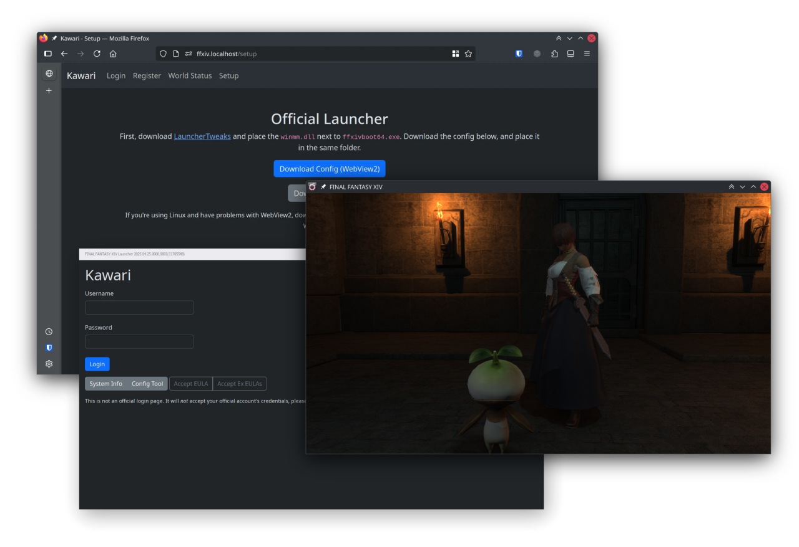

# Kawari

Server emulator for a certain MMO. Updates on the project can be found [on my blog](https://redstrate.com/blog/series/kawari-progress-report/).

## Features

We have a working implementation for most of FFXIV's servers:

* Frontier
    * Used for news, gate status and more.
* Launcher
    * Used to serve the launcher web page.
* Lobby
    * Create a new character and login to a World server.
* Login
    * Logging in and creating new accounts.
* Patch
    * Verifies the game client version. Can't serve patch files yet.
* World
    * Still limited, but supports basic multiplayer and can explore zones.

Kawari is extendable, and content can be easily scripted using our Lua API. See the `resources/scripts` folder for examples.
    
## Goals

Kawari is primarily a research project, but also a way to preserve the modern client. Kawari is...

* **FOR** preservation of the game, in the event that the servers are permanently unavailable.
* **FOR** exploring the packet structure for legitimate purposes (e.g. archival and preservation.)
* **NOT** a way to play the game without a valid subscription. The server can't, nor ever will be a suitable replacement for the real game.
* **NOT** for creating bots, packet modifications or doing anything on the retail servers.

Also please don't use Kawari to spoil new or unreleased content, thanks.

## Supported Game Version

Kawari currently supports patch **7.3** (2025.07.30.0000.0000.) Previously supported patches are provided on as tags (e.g. `2025.02.27.0000.0000`.) These may or may not function or build correctly, the tag is moreso a historical marker.

Only the Global region is supported. Only the Windows client is supported. Supporting other regions or clients are currently out of scope of this project, but might work anyway.

## Running

Kawari is designed to be easy to run. A guide to running Kawari can be followed [here](USAGE.md).

## Contributing

Pull requests for new scripts, features, patch updates, and documentation are welcome. A guide for contributing and updating Kawari can be found [here](CONTRIBUTING.md).

For informal development discussion outside of GitHub, join the [Kawari Dev Chat](https://matrix.to/#/#kawari-welcome:pyra.sh).

## Credits & Thank You

* [Sapphire](https://github.com/SapphireServer/Sapphire) for reference.
* [iolite](https://github.com/0xbbadbeef/iolite) for inspiration & reference.
* [TemporalStasis](https://github.com/NotNite/TemporalStasis) for tooling and reference.
* [Project Chronofoil](https://github.com/ProjectChronofoil/) for easy packet capture.
* [FFXIVClientStructs](https://github.com/aers/FFXIVClientStructs/) for being an invaluable resource for the client's internals.

## License

This project is licensed under the [GNU Affero General Public License 3](LICENSE). Some code or assets may be licensed differently.
