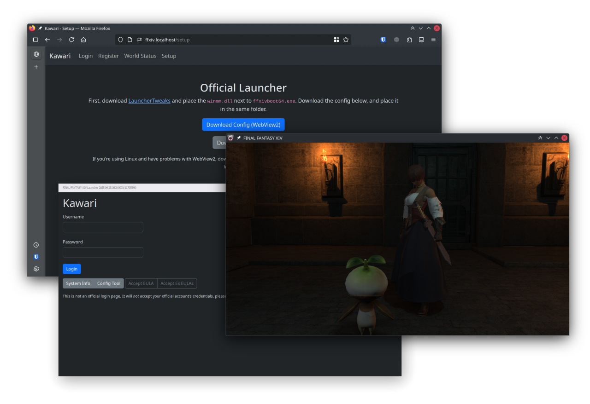

# Kawari

Modern server emulator for FFXIV. Unlike other projects, we actively target the latest version of the Global client. Updates on the project can be found [on my blog](https://redstrate.com/blog/series/kawari-progress-report/).

    
## Goals

Kawari is primarily a research project, but also a way to preserve the modern client. Kawari is...

* **FOR** preservation of the game, in the event that the servers are permanently unavailable.
* **FOR** exploring the packet structure for legitimate purposes (e.g. archival and preservation.)
* **NOT** a way to play the game without a valid subscription. We can't, nor ever will be a suitable replacement for the real game.
* **NOT** for creating bots, packet modifications or doing anything on the retail servers.

For more information, see our [Acceptable Usage](https://docs.xiv.zone/kawari/acceptable_usage.html) document.

## Supported Game Version

Kawari currently supports patch **7.35h1** (2025.10.13.0000.0000) Previously supported patches are provided as tags (e.g. `2025.02.27.0000.0000`.) These may not function or build correctly, these tags are more like historical markers.

Only the Global region is supported. Only the Windows client is supported. Support for other regions and clients are out of scope of this project.

## Running

Kawari is designed to be easy to run. A guide to running Kawari can be followed [here](https://docs.xiv.zone/kawari/setup/overview.html).

## Contributing

Pull requests for new scripts, features, patch updates, and documentation are welcome. A guide for contributing and updating Kawari can be found [here](https://docs.xiv.zone/kawari/contributing.html).

For informal development discussion outside of GitHub, join the [Kawari Dev Chat](https://matrix.to/#/#kawari-welcome:pyra.sh).

## Credits & Thank You

* [Sapphire](https://github.com/SapphireServer/Sapphire) for reference.
* [iolite](https://github.com/0xbbadbeef/iolite) for inspiration & reference.
* [TemporalStasis](https://github.com/NotNite/TemporalStasis) for tooling and reference.
* [Project Chronofoil](https://github.com/ProjectChronofoil/) for easy packet capture.
* [FFXIVClientStructs](https://github.com/aers/FFXIVClientStructs/) for being an invaluable resource for the client's internals.

## License

This project is licensed under the [GNU Affero General Public License 3](LICENSE). Some code or assets may be licensed differently.
