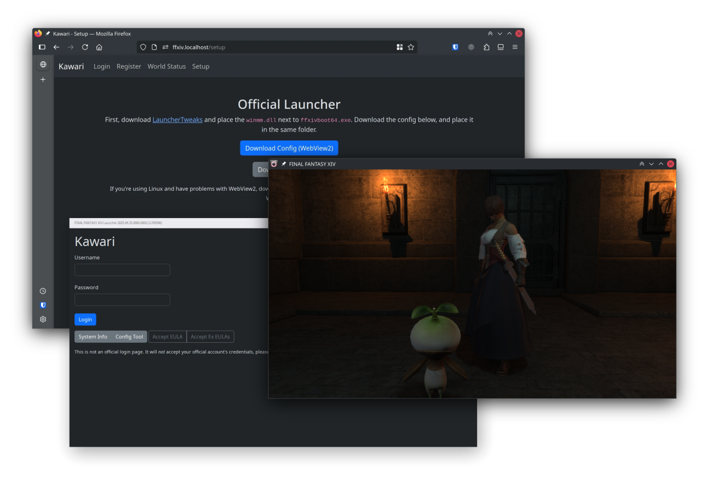

# Kawari

Modern server emulator for FFXIV. Updates for on the project can be found [on my blog](https://redstrate.com/blog/series/kawari-progress-report/).

Kawari currently supports patch **7.45h2** (2026.03.17.0000.0000). We only support the Global Windows client.

To get started, there is a guide to [running Kawari in our documentation](https://docs.xiv.zone/kawari/setup/overview.html).

## Features

It's hard to write down what we support, since the project is always in flux. But here's a basic idea of where we're at:
* The opening sequence
* Basic zone exploration
* Multiplayer
* Instanced content

If you want to implement something that's missing, [see our Contributing guide](https://docs.xiv.zone/kawari/contributing.html)!

## Credits & Thank You

* [iolite](https://github.com/0xbbadbeef/iolite) for inspiration & reference.
* [TemporalStasis](https://github.com/NotNite/TemporalStasis) for tooling and reference.
* [Project Chronofoil](https://github.com/ProjectChronofoil/) for easy packet capture.
* [FFXIVClientStructs](https://github.com/aers/FFXIVClientStructs/) for being an invaluable resource for the client's internals.

## License

This project is licensed under the [GNU Affero General Public License 3](LICENSE). Some code or assets may be licensed differently.
